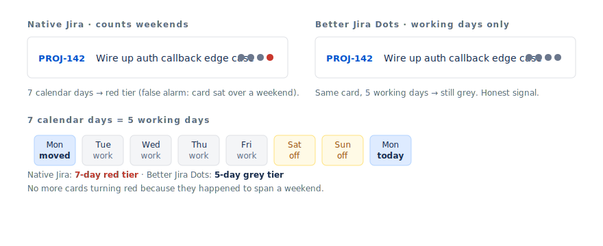
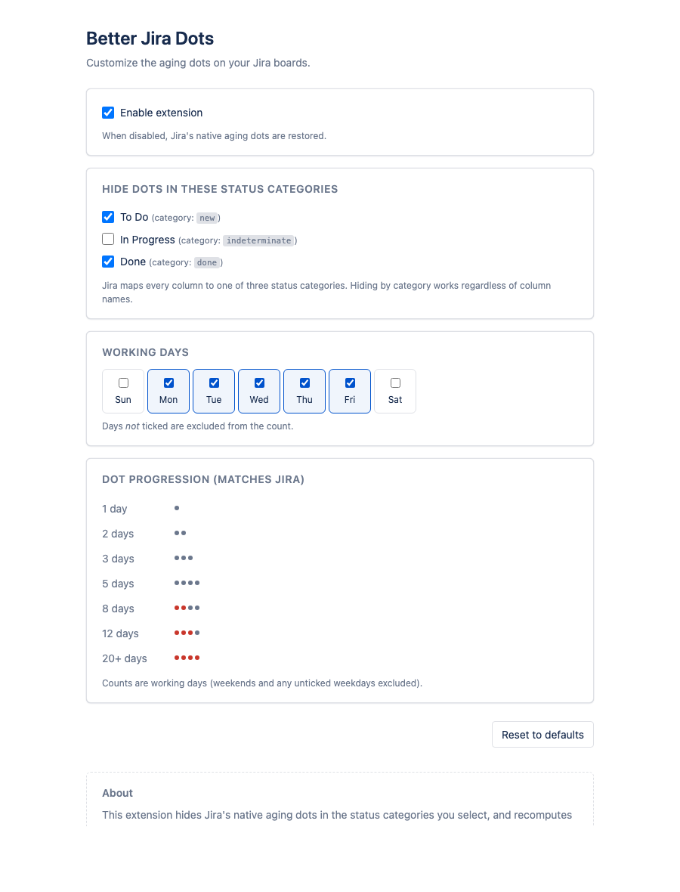
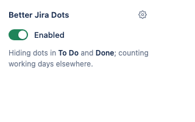

<h1 align="center">Better Jira Dots</h1>

<p align="center">
  <strong>Smarter column-aging indicators for Jira Cloud.</strong><br/>
  Hide aging dots where they're noise. Count working days, not weekends.
</p>

<p align="center">
  <a href="#install"></a>
  <a href="#install"></a>
  <a href="#install"></a>
  <a href="LICENSE"></a>
  <a href="PRIVACY.md"></a>
</p>

<p align="center">
  
</p>

## Why

Jira Cloud's column-aging dots have two problems:

1. **They count weekends.** A card moved Friday afternoon turns red Monday morning, even though no one worked on it.
2. **They're shown everywhere — including To Do and Done.** Aging is only a useful signal where work is actively in flight; on `To Do` and `Done` the dots are visual noise.

Better Jira Dots fixes both, with no third-party servers and no telemetry. It uses the same Jira REST API your browser already has access to.

## Install

> **Coming soon to the Chrome Web Store and Firefox Add-ons.** In the meantime, install from source — it takes 30 seconds.

<details>
<summary><strong>Chrome / Edge / Brave</strong></summary>

1. `git clone https://github.com/pimfm/better-jira-dots.git`
2. Open `chrome://extensions` and enable **Developer mode**.
3. Click **Load unpacked** and select the cloned folder.
</details>

<details>
<summary><strong>Firefox</strong></summary>

1. `git clone https://github.com/pimfm/better-jira-dots.git`
2. Open `about:debugging#/runtime/this-firefox` → **Load Temporary Add-on**.
3. Pick `manifest.json` from the cloned folder.
</details>

## Configure

Click the toolbar icon for a quick on/off, or open the full settings page.

<p align="center">
  
  &nbsp;
  
</p>

| Setting | Default | What it does |
| --- | --- | --- |
| **Hidden status categories** | `To Do`, `Done` | Categories where dots are removed entirely. Add `In Progress` to disable dots everywhere. |
| **Working days** | Mon–Fri | Days *not* ticked are subtracted from the count. Set your own four-day week, observe a different weekend, etc. |

Settings sync across browsers via `chrome.storage.sync`.

## How dots are computed

The dot pattern matches Jira's documented progression. The only difference: working-day count.

| Working days | Pattern |
| --- | --- |
| 1 | ● |
| 2 | ● ● |
| 3 | ● ● ● |
| 4–6 | ● ● ● ● |
| 7 | ● ● ● 🔴 |
| 8–11 | ● ● 🔴 🔴 |
| 12–19 | ● 🔴 🔴 🔴 |
| 20+ | 🔴 🔴 🔴 🔴 |

## How it works

1. A content script runs on Jira Cloud board pages.
2. A `MutationObserver` watches for cards being added or moved.
3. For each card with a native aging indicator, the extension fetches `/rest/api/3/issue/{key}?expand=changelog&fields=status` (cached, same-origin) and finds the timestamp of the most recent status change.
4. If the card's status category is hidden, the native indicator is hidden and nothing is rendered.
5. Otherwise, the extension counts working days from that timestamp to now and renders its own dots in the exact slot Jira used.

The native indicator is hidden via CSS so the extension's count is the only one shown.

## Build for the stores

```sh
npm run package
```

Produces:
- `dist/better-jira-dots-chrome.zip` — for the Chrome Web Store
- `dist/better-jira-dots-firefox.zip` — for `addons.mozilla.org`

Submission walkthrough: [`docs/RELEASE.md`](docs/RELEASE.md).
Store listing copy: [`docs/store/`](docs/store/).

## Privacy

No data leaves your browser. The extension only calls Jira's own REST API on the tab you have open. See [PRIVACY.md](PRIVACY.md).

## Project layout

```
manifest.json
src/
  content/   injected on Jira pages — settings, api, workdays, dots, main
  options/   settings UI (full page)
  popup/     toolbar quick-toggle
styles/
  content.css  hides native dots, styles custom ones
icons/       16/32/48/128 PNGs
_locales/en/ i18n strings
scripts/     build + icon generator
docs/        store listing copy + release walkthrough
assets/      README and store screenshots
```

## Contributing

Bug reports and PRs welcome. The codebase is plain JS — no bundler, no framework. Run `npm run lint` before submitting.

## License

[MIT](LICENSE) — © Pim van Gurp.
